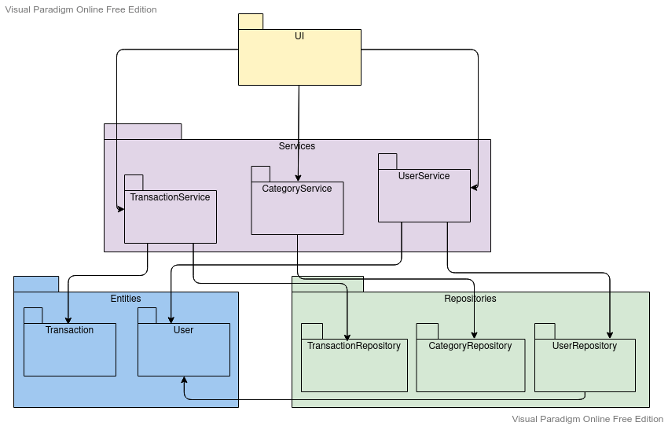

# Arkkitehtuurikuvaus

## Rakenne

Koodin pakkausrakenne on seuraava:

Pakkaus `ui` sisältää käyttöliittymäkoodin, `services` sovelluslogiikan sekä `repositories` tietojen tallennukseen liittyvän koodin. Pakkaus `entities` sisältää luokat `Transaction`, `User` ja `Category`, jotka kuvastavat yksittäisiä sovelluksen käyttämiä tietoyksiköitä.

## Käyttöliittymä

Sovelluksen käyttöliittymä sisältää seuraavat näkymät:

* Kirjautuminen
* Uuden käyttäjätilin luominen
* Tapahtumien tarkastelu (**päänäkymä**)
* Uuden tapahtuman lisäys
* Tapahtuman muokkaus
* Kategorioiden tarkastelu
* Uuden kategorian lisäys

Eri näkyvistä vastaa `UI`-luokka. Sovelluslogiikka tapahtuu `BudgetService`-luokassa, jonka metodeja `UI`-luokka kutsuu.

## Sovelluslogiikka

Luokka `User` kuvaa käyttäjää ja `Transaction` käyttäjän lisäämiä tapahtumia.

Sovelluslogiikasta vastaa `BudgetService`-luokan olio. Jokaista käyttöliittymän toimintoa vastaa yksi `BudgetService`-luokan metodi. Näitä metodeja ovat esimerkiksi:

* `create_user(username, password1, password2)`
* `find_transactions()`
* `delete_category(category_id)`

`BudgetService`-luokka ei vastaa tiedon tallennuksesta, vaan tarvittaessa `BudgetService`-luokka kutsuu `Repositories`-pakkauksen luokkia `UserRepository`, `TransactionRepository` ja `CategoryRepository`.

## Tiedon tallennus

`Repositories`-pakkauksen luokat `UserRepository`, `TransactionRepository` ja `CategoryRepository` huolehtivat tiedon tallentamisesta. Kaikki tieto tallennetaan [SQLite](https://www.sqlite.org/)-tietokantaan. Tietokannan nimi on määritelty `.env.`-tiedostossa, ja se on oletuksena `expensetracker.db`.

Tietokanta alustetaan `initialize_database.py`-tiedostossa, joka suoritetaan automaattisesti alustustoimenpiteiden aikana (`poetry run invoke build`).

## Toiminnallisuudet

### Uuden käyttäjän luominen

### Uuden tapahtuman luominen

### Uuden kategorian lisääminen

