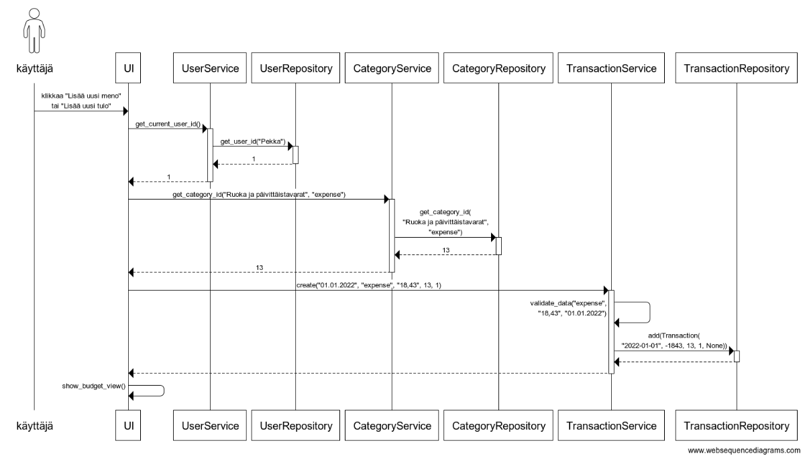

# Arkkitehtuurikuvaus

## Rakenne

Koodin pakkausrakenne on seuraava:

Pakkaus `UI` sisältää Pythonin standardikirjastoon kuuluvalla [`tkinter`-moduulilla](https://docs.python.org/3/library/tkinter.html) toteutetun käyttöliittymäkoodin, `Services` sovelluslogiikan sekä `Repositories` tietojen tallennukseen ja hakemiseen liittyvän koodin. Pakkaus `Entities` sisältää luokat `Transaction` ja `User`, jotka kuvastavat yksittäisiä sovelluksen käyttämiä tietoyksiköitä.

## Käyttöliittymä

Sovelluksen käyttöliittymä sisältää yhteensä kuusi eri näkymää:

* Kirjautuminen
* Uuden käyttäjätilin luominen
* Tapahtumien tarkastelu (**päänäkymä**)
* Tapahtuman muokkaus ja lisäys
* Kategorioiden tarkastelu
* Uuden kategorian lisäys

Eri näkymistä vastaa `UI`-luokka. Sovelluslogiikka tapahtuu `Services`-pakkauksen luokissa, joiden metodeja `UI`-luokasta kutsutaan.

## Sovelluslogiikka

Luokka `User` kuvaa käyttäjää ja `Transaction` käyttäjän lisäämiä tapahtumia.

Sovelluslogiikasta vastaa kolme eri `Services`-pakkauksen oliota. `Services`-pakkauksen toteutus vastaa `Repositories`-pakkauksen toteutusta, eli `TransactionService` vastaa tapahtumiin liittyvästä sovelluslogiikasta, `UserService` vastaa käyttäjiin liittyvästä sovelluslogiikasta ja `CategoryService` kategorioihin liittyvästä sovelluslogiikasta.

Jokaista käyttöliittymän toimintoa vastaa yksi `Services`-pakkaukseen kuuluvien luokkien metodeista. Näitä ovat esimerkiksi:

* `UserService.create(username, password1, password2)`
* `TransactionService.get_one(transaction_id)`
* `CategoryService.delete(category_id, user_id)`

Kuten ylempänä esitetystä pakkauskaaviosta voi huomata, käyttöliittymäolio kutsuu ainoastaan sovelluslogiikasta vastaavia olioita, ja tiedon tallennus on keskitetty kokonaan `Repositories`-pakkauksen luokille. Näin ollen esimerkiksi tiedon tallennustapaa voisi muuttaa ilman tarvetta päivittää sovelluslogiikkaa. Sovelluslogiikasta vastaavista luokista tarvittaessa vain kutsutaan `Repositories`-pakkauksen luokkia `UserRepository`, `TransactionRepository` ja `CategoryRepository`.

## Tiedon tallennus

Luokkien suunnittelussa on noudatettu repository-suunnittelumallia, mikä tarkoittaa että tiedon haku ja tallennus on eriytetty omiin osiinsa. Tällöin jokaisella tietokohteella (tämän sovelluksen tapauksessa käyttäjät, tapahtumat ja kategoriat) on oma repositorionsa.

`Repositories`-pakkauksen luokat `UserRepository`, `TransactionRepository` ja `CategoryRepository` huolehtivat tiedon tallentamisesta ja hakemisesta. Kaikki tieto tallennetaan [SQLite](https://www.sqlite.org/)-tietokantaan. Tietokannan nimi on määritelty `.env`-tiedostossa, ja se on oletuksena `expensetracker.db`. Testien suorittamista varten on oma tietokantansa.

Tietokanta alustetaan `initialize_database.py`-tiedostossa, joka suoritetaan automaattisesti alustustoimenpiteiden aikana (`poetry run invoke build`).

Tietokanta sisältää neljä taulua: `Users`, `Transactions`, `Categories` ja `CategoryVisibilities`. Kolme ensimmäistä taulua vastaa läpi sovelluksen esiintyviä vastaavia tietorakenteita, ja viimeksi mainittu sisältää tiedon siitä, mitkä kategoriat kullekin käyttäjälle näytetään. Näin siksi, että kullakin sovelluksen käyttäjistä on omat kategoriansa, ja kunkin käyttäjän tulee pystyä poistamaan kategorioita vain itseltään. Käyttäjän ”poistaessa” kategorian sitä ei todellisuudessa poisteta, vaan ainoastaan piilotetaan häneltä.

Tarkempaa tietoa sovelluksen käyttämän tietokannan rakenteesta voit katsoa [täältä](https://github.com/valtterikantanen/ot-harjoitustyo/blob/master/src/initialize_database.py).

## Päätoiminnallisuudet

Alla on kuvattu sekvenssikaavioina sovelluksen toimintalogiikka muutaman päätoiminnallisuuden osalta. 

### Rekisteröityminen ja sisäänkirjautuminen

Sovelluksen alkunäkymässä käyttäjä klikkaa ”Luo uusi käyttäjätili” -painiketta. Avautuvassa näkymässä käyttäjä syöttää haluamansa käyttäjätunnuksen ja salasanan, ja tämän jälkeen painaa ”Luo käyttäjätili”. Tämän jälkeen käyttöliittymä kutsuu `UserService`-luokan `create`-funktiota, jossa syötteet testataan mahdollisten virheiden varalta (mm. jokin syötteistä tyhjä, salasana ja sen vahvistus eivät täsmää). Jos syötteet ovat kunnossa, `UserService` kutsuu `UserRepository`-luokan `create`-funktiota parametrinaan `User`-olio. `UserRepository` palauttaa juuri luodun käyttäjätilin id:n, joka myös `UserService`-luokasta välitetään käyttöliittymälle.

Käyttäjätilin luomisen jälkeen käyttäjälle lisätään vielä oletuskategoriat. Käyttöliittymästä kutsutaan `CategoryService`-luokan funktiota `add_default_categories` parametrinaan juuri luodun käyttäjätilin id. `CategoryService`-luokasta kutsutaan `CategoryRepository`-luokkaa, joka hoitaa varsinaisen lisäyksen.

Viimeisenä käyttäjä kirjataan automaattisesti sisään kutsumalla jälleen käyttöliittymästä `UserService`-luokan `login`-funktiota parametrinaan käyttäjätunnus ja salasana, minkä jälkeen `UserService`-luokasta kutsutaan `UserRepository`-luokan `search_by_username`-funktiota parametrinaan käyttäjätunnus. Syötettyjä tietoja verrataan `search_by_username`-funktion palauttamiin arvoihin, ja jos ne vastaavat toisiaan, niin käyttäjä kirjataan sisään ja hänet siirretään sovelluksen budjetti- eli päänäkymään.

### Uuden tapahtuman lisääminen

Kirjautunut käyttäjä klikkaa sovelluksen budjetti- eli päänäkymästä tapahtumasta riippuen joko ”Lisää uusi meno” tai ”Lisää uusi tulo”. Molemmat valinnat johtavat samaan näkymään, mutta näkymälle välitetään tieto siitä, onko käyttäjä lisäämässä menoa vai tuloa. Käyttäjä syöttää avautuvalle lomakkeelle vähintään päivämäärän, kategorian ja määrän sekä vapaaehtoisen kuvauksen ja klikkaa ”Lisää tapahtuma”-painiketta.

Tämän jälkeen käyttöliittymä kutsuu `UserService`-luokan `get_current_user_id`-funktiota, joka edelleen kutsuu `UserRepository`-luokan funktiota `get_user_id` parametrinaan sisäänkirjautuneen käyttäjän käyttäjätunnus. `UserRepository` ja `UserService` palauttavat käyttäjän id:n. Lisäksi kutsutaan `CategoryService`-luokan `get_category_id`-funktiota, jolle annetaan parametriksi kategorian nimi ja tyyppi. Samoilla parametreilla kutsutaan `CategoryRepository`-luokan `get_category_id`-funktiota, joka palauttaa kategorian id:n. `CategoryService` palauttaa saman id:n käyttöliittymälle.

Seuraavaksi käyttöliittymästä kutsutaan `TransactionService`-luokan `create`-funktiota parametrinaan tapahtuman ajankohta, tyyppi (meno vai tulo), summa, kategorian id sekä käyttäjän id. Tämän jälkeen `TransactionService`-luokassa ajankohta ja summa validoidaan. Jos parametrit olivat kunnossa, kutsutaan `TransactionRepository`-luokan `add`-funktiota ja annetaan sille parametriksi `Transaction`-olio, joka sisältää tapahtuman tiedot. Tapahtuman lisäyksen jälkeen käyttäjä siirretään sovelluksen päänäkymään.

### Uuden kategorian lisääminen

Kirjautunut käyttäjä klikkaa sovelluksen päänäkymässä ”Tarkastele kategorioita” -painiketta ja seuraavassa näkymässä ”Lisää kategoria”. Käyttäjä syöttää avautuvalle lomakkeelle kategorian nimen sekä tyypin (meno vai tulo) ja klikkaa ”Lisää kategoria”-painiketta.

Tämän jälkeen käyttöliittymä kutsuu `UserService`-luokan `get_current_user_id`-funktiota, joka edelleen kutsuu `UserRepository`-luokan funktiota `get_user_id` parametrinaan sisäänkirjautuneen käyttäjän käyttäjätunnus. `UserRepository` ja `UserService` palauttavat käyttäjän id:n.

Seuraavaksi käyttöliittymästä kutsutaan `CategoryService`-luokan `add`-funktiota, jonka parametriksi annetaan kategorian nimi, tyyppi ja käyttäjän id. `CategoryService`-luokasta kutsutaan edelleen `CategoryRepository`-luokan funktiota `add`, joka suorittaa varsinaisen lisäyksen. Lisäyksen jälkeen käyttäjä siirretään kategorianäkymään.

### Muut toiminnallisuudet

Muutkin toiminnallisuudet toimivat pääasiassa samalla logiikalla. Käyttöliittymästä kutsutaan jotakin kolmesta sovelluslogiikasta vastaavasta luokasta, josta tarvittaessa kutsutaan jonkin repositorio-luokan metodia. Onnistuneen suorituksen jälkeen käyttäjä ohjataan esimerkiksi päänäkymään. Virhetilanteissa sovellus antaa virheilmoituksen, ja joissakin tilanteissa myös toiminnan suorittamista saa ilmoituksen (esim. tapahtuman päivitys).