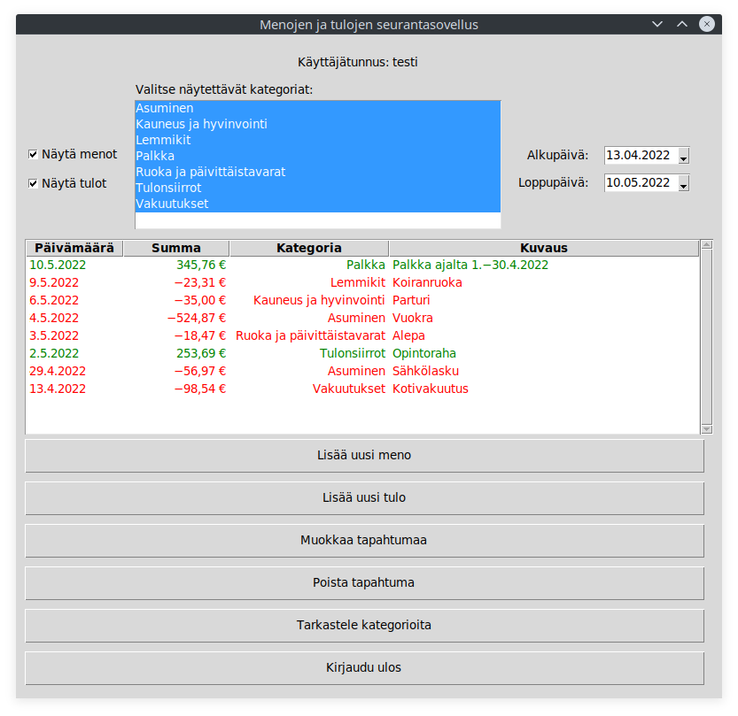
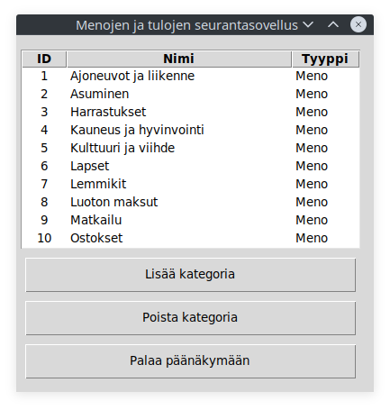

# Käyttöohje

## Asennus ja käyttöönotto

Tallenna sovelluksen lähdekoodi zip-pakettina [tästä](https://github.com/valtterikantanen/ot-harjoitustyo/archive/refs/tags/loppupalautus.zip) ja pura se. Purkamisen jälkeen siirry projektin juurikansioon. Juurikansiossa suorita ensin komento  

```
$ poetry install
```
joka asentaa sovelluksen tarvitsemat kirjastot. Seuraavaksi suorita alustustoimenpiteet komennolla
```
$ poetry run invoke build
```
Tämän jälkeen ohjelma on valmiina käytettäväksi. Ohjelman voi käynnistää komennolla
```
$ poetry run invoke start
```

## Kirjautuminen

Sovellus käynnistyy kirjautumisnäkymään:


Kirjautuminen tapahtuu kirjoittamalla käyttäjätunnus ja salasana vastaaviin kenttiin ja painamalla ”Kirjaudu sisään”-painiketta.

## Uuden käyttäjätilin luominen

Mikäli käyttäjätiliä ei vielä ole luotu, kirjautumisnäkymästä pääsee siirtymään uuden käyttäjätilin luomisnäkymään painamalla ”Luo uusi käyttäjätili”-painiketta.


Uusi käyttäjä luodaan syöttämällä tiedot kenttiin ja painamalla ”Luo käyttäjätili”-painiketta. Käyttäjätunnus ja salasana eivät saa olla tyhjiä.

Jos uuden käyttäjätilin luominen onnistuu, ohjelma kirjaa uuden käyttäjän automaattisesti sisään ja avaa näkymän, jossa listataan käyttäjän lisäämät tapahtumat.

## Tapahtumien tarkastelu

Kirjautumisen tai rekisteröitymisen jälkeen siirrytään sovelluksen **päänäkymään**, jossa listataan käyttäjän lisäämät tapahtumat. Uusin tapahtuma on ylimpänä, vanhin alimpana.



Näytettäviä tapahtumia voi rajata seuraavasti:

* Menot näytetään vain, jos ”Näytä menot” on valittuna
* Tulot näytetään vain, jos ”Näytä tulot” on valittuna
* Tapahtumat näytetään vain niistä kategorioista, jotka ovat valittuina listalla (oletuksena kaikki on valittu)
* Tapahtumista näytetään vain ne, joiden ajankohta on alkupäivän ja loppupäivän välillä

Näkymästä pääsee lisäämään uusia tapahtumia valitsemalla ”Lisää uusi meno” tai ”Lisää uusi tulo”. Olemassaolevia tapahtumia voi muokata klikkaamalla muokattavaa tapahtumaa ja valitsemalla ”Muokkaa tapahtumaa”. Tapahtuman voi poistaa kokonaan klikkaamalla poistettavaa tapahtumaa ja valitsemalla ”Poista tapahtuma”.

Kategorioita (*Asuminen*, *Ruoka ja päivittäistavarat* jne.) pääsee tarkastelemaan, lisäämään ja poistamaan klikkaamalla ”Tarkastele kategorioita”. Klikkaamalla ”Kirjaudu ulos” käyttäjä kirjataan ulos sovelluksesta, jolloin ovellus siirtyy kirjautumisnäkymään.

## Tapahtuman lisääminen

Päänäkymästä pääsee lisäämään uusia tapahtumia valitsemalla ”Lisää uusi meno” tai ”Lisää uusi tulo”, jolloin aukeaa seuraava näkymä:


Päivämäärä, kategoria ja määrä ovat pakollisia, kuvaus on vapaaehtoinen.

Päivämäärän voi syöttää joko kirjoittamalla muodossa ”pp.kk.vvvv” tai klikkaamalla kentän oikeassa reunassa näkyvää nuolta, jolloin oikean päivän voi valita avautuvasta kalenterinäkymästä.

Kategoria valitaan pudotusvalikon vaihtoehdoista. Päänäkymän valinnasta (”Lisää uusi meno” tai ”Lisää uusi tulo”) riippuen listassa näytetään vain joko meno- tai tulokategoriat.

Määrä tulee syöttää ilman välilyöntejä joko kokonaislukuna tai desimaalimuodossa, jolloin desimaalierottimena voi käyttää pistettä tai pilkkua. Määrä syötetään positiivisena riippumatta siitä, onko kyseessä meno vai tulo. Muita merkkejä (esim. euron merkkiä €) ei tule sisällyttää kenttään. Suurin mahdollinen määrä on 9 999 999,99 €.

Kuvaukseen voi sisällyttää mitä tahansa merkkejä, ja sen maksimipituus on 50 merkkiä.

Kun kaikki tiedot on kirjoitettu, tapahtuma lisätään painamalla ”Lisää tapahtuma”-painiketta, minkä jälkeen siirrytään takaisin päänäkymään. Myös painamalla ”Peruuta”-painiketta pääsee takaisin päänäkymään, jolloin tapahtumaa ei lisätä.

## Kategorioiden lisääminen ja poistaminen

Päänäkymästä pääsee tarkastelemaan, lisäämään ja poistamaan kategorioita valitsemalla ”Tarkastele kategorioita”, jolloin aukeaa seuraava näkymä:



Kategorian voi poistaa klikkaamalla poistettavaa kategoriaa ja valitsemalla ”Poista kategoria”. Uuden kategorian voi lisätä klikkaamalla Lisää kategoria”-painiketta, jolloin aukeaa seuraava näkymä:


Nimi-kenttään kirjoitetaan lisättävän kategorian nimi, ja pudotusvalikosta valitaan kategorian tyyppi (meno tai tulo). Kun vaaditut nimi ja tyyppi on valittu, klikkaamalla ”Lisää kategoria” kategoria lisätään, minkä jälkeen lista kategorioista avautuu. Myös painamalla ”Peruuta”-painiketta pääsee takaisin samaan näkymään, jolloin kategoriaa ei lisätä.