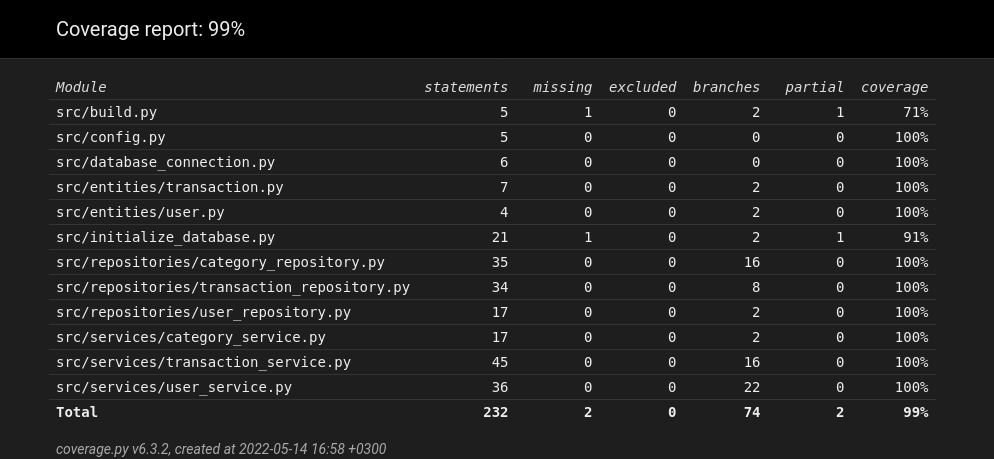

# Testausdokumentti

## Yksikkö- ja integraatiotestaus
Sovellusta on yksikkötestattu [unittest](https://docs.python.org/3/library/unittest.html)-sovelluskehystä käyttäen.

### Sovelluslogiikka
Jokaiselle sovelluslogiikasta vastaavalle luokalle (`UserService`, `TransactionService` ja `CategoryService`) on luotu omat testiluokat. Testien toteuttamiseksi `.env.test`-tiedostossa on määritelty, että testeissä ei käytetä samaa tietokantaa kuin sovellus tavallisesti käyttää. Oletuksena testitietokannan nimi on `testdatabase.db`. Tämän johdosta testien suorittaminen ei tyhjennä pysyväistalletettuja tietoja.

### Repositorio-luokat
Ainoastaan `CategoryRepository`-luokalle on tehty oma testiluokkansa `TestCategoryRepository`. Kyseisessä luokassa on vain yksi testi sellaista ominaisuutta varten, jota tällä hetkellä hyödynnetään ainoastaan luokan sisällä. Muiden repositorio-luokkien toiminta on tullut testatuksi samalla `service`-luokkien testien kanssa.

### Testikattavuus

Koodin testauksen haaraumakattavuus on 99 %.

Testauksen ulkopuolelle jätettiin käyttöliittymäkoodin sisältävän `ui`-kansion tiedostot. Myöskään `initialize_database.py`- ja `build.py` tiedostojen suorittamista komentoriviltä ei ole testattu. Muiden tiedostojen osalta testikattavuus on 100 %. 

## Järjestelmätestaus

### Asennus ja käynnistäminen
Sovellus on asennettu [käyttöohjeen](https://github.com/valtterikantanen/ot-harjoitustyo/blob/master/dokumentaatio/kayttoohje.md) mukaisesti Linux-ympäristössä (uusimmat päivitykset sisältävä [Cubbli 20](https://wiki.helsinki.fi/display/it4sci/Cubbli+Linux) -fuksiläppäri). Käyttöä ei ole testattu lainkaan Windows- tai macOS-käyttöjärjestelmillä.

### Toiminnallisuudet
Kaikkien [vaatimusmäärittelyn](https://github.com/valtterikantanen/ot-harjoitustyo/blob/master/dokumentaatio/vaatimusmaarittely.md) mukaisten ominaisuuksien toiminta on testattu manuaalisesti. Lisäksi lomakkeita on yritetty tarkoituksella täyttää virheellisillä arvoilla. Näissäkään tapauksissa ohjelma ei ole kaatunut, vaan käyttöliittymässä on näytetty asianmukainen virheilmoitus.

## Tiedossa olevat ongelmat
Jos sovelluksen käynnistää ilman alustustoimenpiteiden suorittamista, sovellus käynnistyy. Kuitenkaan esimerkiksi uuden käyttäjätilin luominen ei onnistu, koska tällöin tietokantatauluja ei ole luotu. Tällöin sovellukseen ei tule näkyviin virheilmoitusta, vaan komentoriville tulostuu traceback.