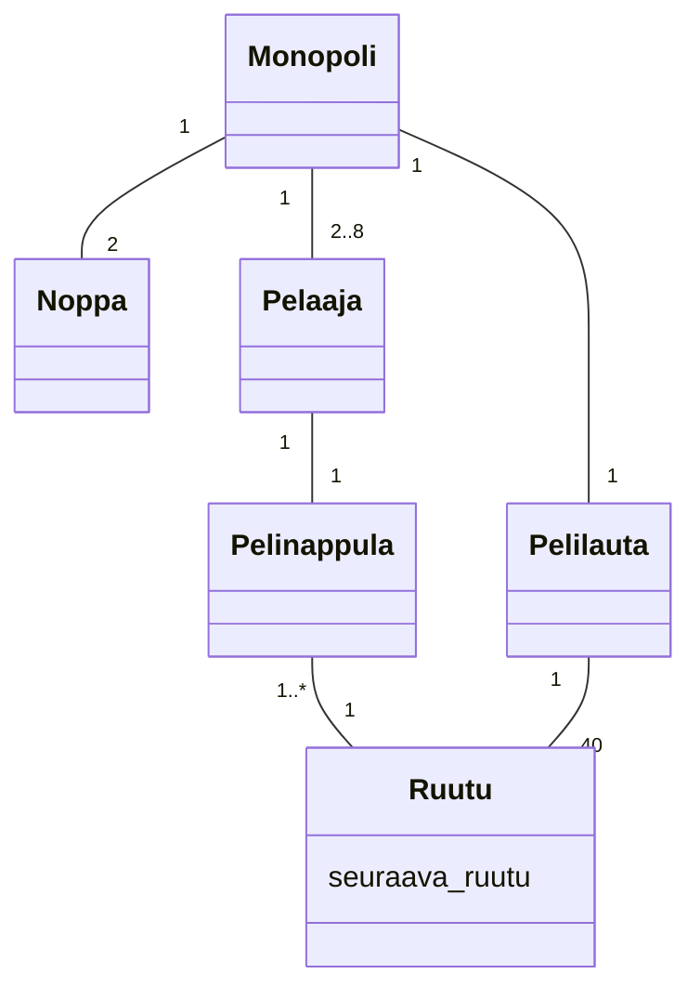

## Tehtävä 1

```mermaid
classDiagram
    Monopoli "1" -- "1" Pelilauta
    Monopoli "1" -- "2" Noppa
    Monopoli "1" -- "2..8" Pelaaja
    Pelinappula "1..*" -- "1" Ruutu
    Pelilauta "1" -- "40" Ruutu
    Pelaaja "1" -- "1" Pelinappula
    
    Ruutu : seuraava_ruutu
```