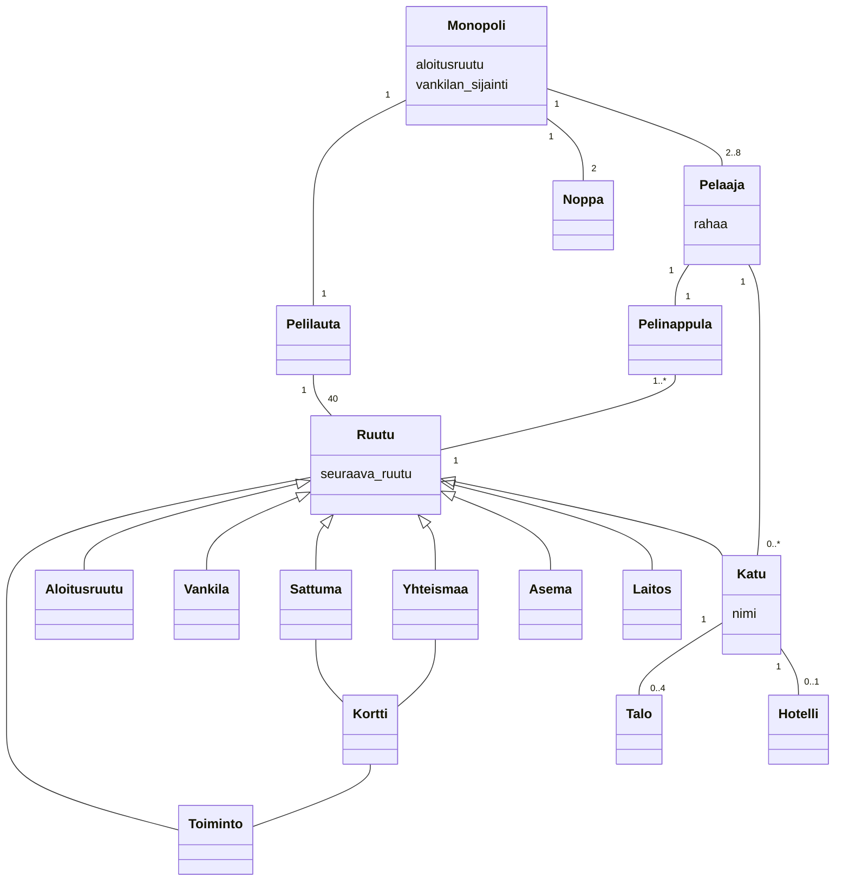

## Tehtävä 2

```mermaid
classDiagram
    Monopoli "1" -- "1" Pelilauta
    Monopoli "1" -- "2" Noppa
    Monopoli "1" -- "2..8" Pelaaja
    Pelinappula "1..*" -- "1" Ruutu
    Pelilauta "1" -- "40" Ruutu
    Pelaaja "1" -- "1" Pelinappula

    Ruutu -- Toiminto

    Ruutu <|-- Aloitusruutu
    Ruutu <|-- Vankila
    Ruutu <|-- Sattuma
    Ruutu <|-- Yhteismaa
    Ruutu <|-- Asema
    Ruutu <|-- Laitos
    Ruutu <|-- Katu

    Sattuma -- Kortti
    Yhteismaa -- Kortti

    Kortti -- Toiminto

    Katu "1" -- "0..4" Talo
    Katu "1" -- "0..1" Hotelli

    Pelaaja "1" -- "0..*" Katu

    Pelaaja : rahaa

    Ruutu : seuraava_ruutu

    Katu : nimi

    Monopoli : aloitusruutu
    Monopoli : vankilan_sijainti
```